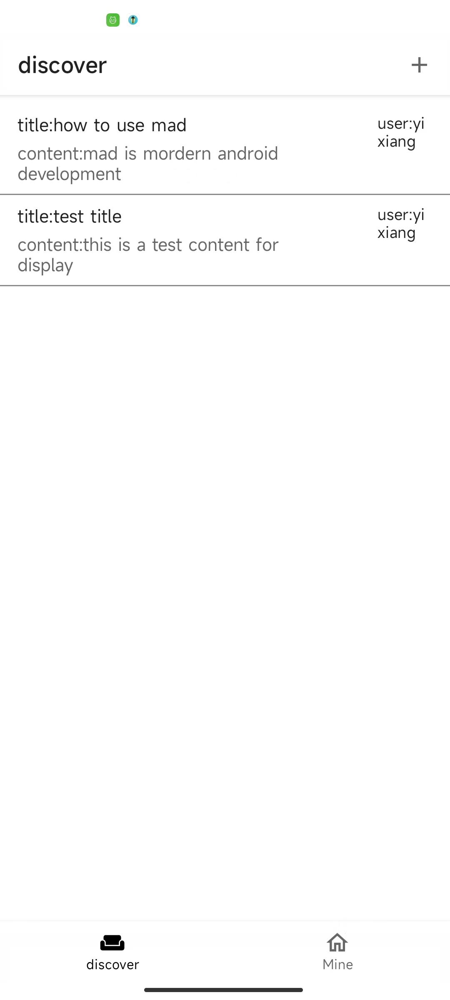
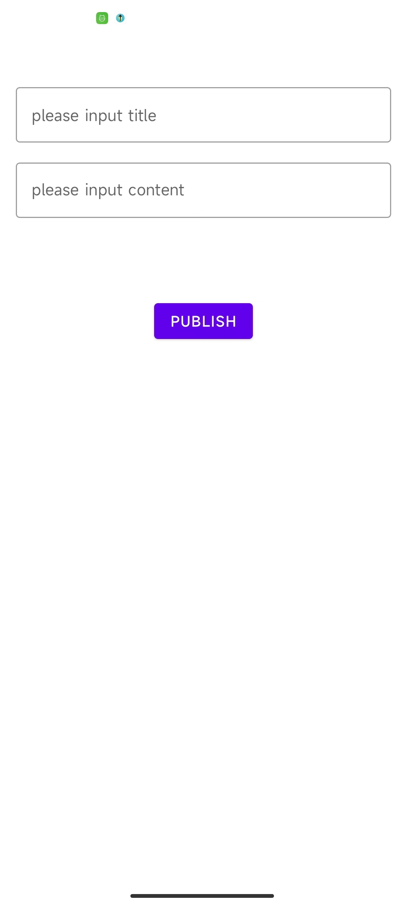
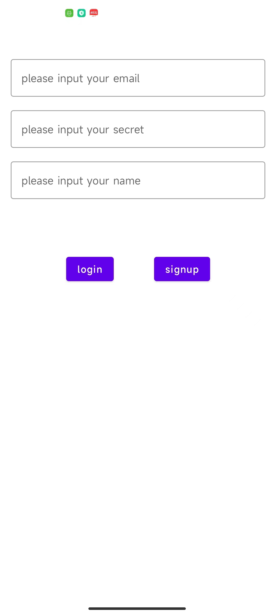
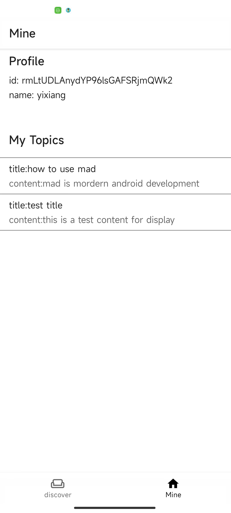

Google I/O Android App(work in progress)
======================
## Description
Sad is a demo app which uses modern android develop

## Android development skills

* 100% written in [Kotlin](https://kotlinlang.org/)
* Even though the UI of Sad is really simple but 100% written in [Jetpack Compose](https://developer.android.com/jetpack/compose)
* Uses [Kotlin Coroutines](https://kotlinlang.org/docs/reference/coroutines/coroutines-guide.html) and [Kotlin Flow](https://developer.android.com/kotlin/flow) for asynchronous operations
* Follow [architecture guidance](https://developer.android.com/topic/architecture) for architecture design
* Uses A single-activity architecture, using [Navigation](https://developer.android.com/guide/navigation) for user face navigation
* Uses [Firebase](https://firebase.google.com/) for store data, auth user and crashlytics
* Uses [Hilt](https://dagger.dev/hilt/) for dependency injection
* Uses [Room](https://developer.android.com/training/data-storage/room) for save and fetch data
* Uses [Startup](https://developer.android.com/topic/libraries/app-startup) for application start init component
* Uses [Robolectric](http://robolectric.org/) and [Mockito](https://site.mockito.org/) for unit test

## Feature
Sad needs to run on a real hardware device, if in china also needs to use vpn

Sad is app which user can publish topics for other user read or discover other topics

### discover
user can find all topics

### publish
user can publish a new topic

### auth
user sign in and sign up

### mine
user see profile
